# Architecture v2 — LoanBid Exchange

## 1) Core Services
- **Borrower Intake**: request form, consent, KYC-lite
- **Routing Engine**: lender eligibility + appetite rules
- **Bid Orchestrator**: invitations, SLA timers, offer collection
- **Ranking Service**: normalized scoring + explanations
- **Lender Connector**: API adapters for lender systems
- **Compliance/Audit**: immutable event ledger + policy checks
- **Analytics**: funnel, lender quality, pricing outcomes

## 2) End-to-End Flow

```mermaid
flowchart LR
A[Borrower request] --> B[KYC-lite + consent]
B --> C[Eligibility routing]
C --> D[Invite lenders]
D --> E[Indicative pre-offers]
E --> F[Anonymized ranking board]
F --> G[Borrower shortlist]
G --> H[Reveal lender identities]
H --> I[Redirect to lender underwriting]
I --> J[Funded / lost outcome]
J --> K[Revenue settlement + analytics]
```

## 3) Data Contracts
### Borrower Request
- requestId, borrowerProfileLight, amount, tenor, purpose, consentRef, createdAt

### Lender Offer
- offerId, requestId, lenderAnonId, apr, fees, tenor, monthlyEstimate, conditions, expiry, submittedAt

### Outcome
- status (shortlisted/accepted/funded/declined), fundedAmount, lenderId, timestamps

## 4) Security & Trust
- Tokenized PII boundaries
- Signed API requests between platform and lenders
- Full event audit for ranking and disclosures
- Separation of offer scoring from business settlement logic

## 5) Israel Launch Considerations
- Localized disclosure language for indicative vs final terms
- Policy hooks for legal text/versioning
- Audit export capability for regulator/legal review
