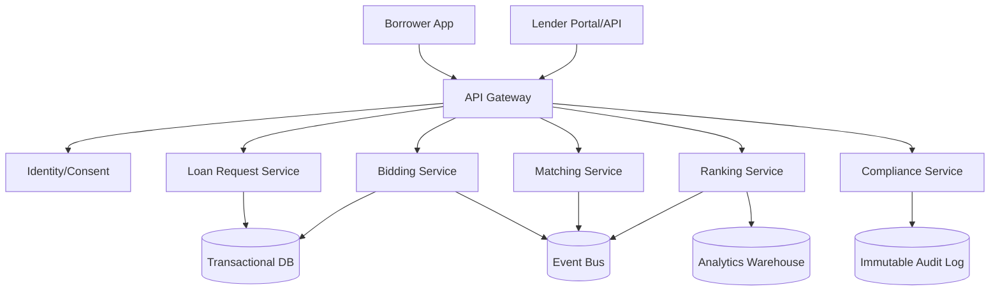

# Architecture — LoanBid Exchange

## Logical Components
- Identity & Consent Service
- Borrower Request Service
- Matching Service
- Bidding Service
- Ranking & Explainability Service
- Compliance & Audit Service
- Lender Integration API Gateway
- Borrower Web App
- Lender Portal/API

## Event Flow

```mermaid
flowchart LR
A[Borrower submits request] --> B[Consent + KYC]
B --> C[Matching engine selects eligible lenders]
C --> D[Bid invitations sent]
D --> E[Lenders submit bids]
E --> F[Ranking + explanation]
F --> G[Borrower compares offers]
G --> H[Borrower accepts offer]
H --> I[Lender underwriting finalization]
I --> J[Disbursement + settlement]
J --> K[Audit + analytics]
```

## Service Topology

## Data Stores
- Transactional DB: requests, bids, sessions, statuses
- Audit Log (append-only): consents, bid updates, ranking rationale, decision events
- Warehouse: performance, cohort, lender quality analytics

## Security Baseline
- Encryption at rest + transit
- Signed lender API requests
- RBAC for internal operators
- PII tokenization for non-essential services
- Tamper-evident audit records
