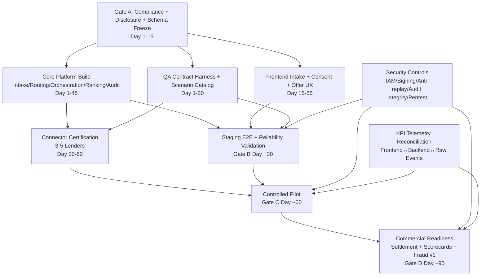

# Orchestrator Review — Consolidated Execution Instructions (LoanBid Exchange V1)

Date: 2026-02-21  
Owner: Orchestrator  
Inputs reviewed: `IMPLEMENTATION_PLAN.md` + specialist reviews (`product-manager`, `backend-dev`, `frontend-dev`, `qa-reliability`, `security-compliance`)

## 1) Executive Synthesis
The program is executable in 90 days **if and only if** launch blockers are enforced in sequence:
1. **Compliance + schema freeze first** (no parallel bypass)
2. **Core marketplace reliability before scale**
3. **Pilot stability before commercial expansion/monetization complexity**

Primary correction to baseline plan: treat security/compliance evidence, telemetry trust, and connector certification as **hard gates** (not soft checklist items).

---

## 2) Unified Dependency Graph

## Critical Path
- A (freeze) → B/C/D → F (staging gate) → E+F → G (pilot gate) → H (commercial gate)

## Parallelizable Streams (safe)
- Backend modular scaffolding + frontend route/component scaffolding + QA harness bootstrap can run in parallel **after contracts/disclosures freeze**.
- Security control implementation runs in parallel but must pass gating checks before pilot/commercial transitions.

---

## 3) Sequencing Plan (12 Weeks)

## Phase 0 — Program Mobilization (Days 1–3)
- Confirm MVP non-goals (no binding underwriting, no advanced ML, no multi-country)
- Establish single KPI scoreboard and single risk register
- Name owners for each gate evidence packet

## Phase 1 — Gate A: Compliance + Contract Freeze (Days 1–15)
**Deliverables**
- Disclosure copy (indicative vs final) finalized and versioned
- Canonical schemas frozen (`BorrowerRequest`, `LenderOffer`, `Outcome`)
- Consent traceability model locked (`consentRef`, `disclosureVersionId`, timestamp)
- Threat model + trust boundaries + data classification approved

**Exit criteria**
- Legal/compliance sign-off complete
- Contract v1.0 tagged and published
- No team begins connector production onboarding before this gate

## Phase 2 — Platform + UX Core Build (Days 10–45)
**Backend**
- Intake, routing, orchestration, offer ingestion, ranking explainability, shortlist/reveal, immutable audit ledger
- Idempotency + signed lender requests + anti-replay

**Frontend**
- 4-step intake wizard, consent gate, matching progress, offer board, shortlist/reveal flow, handoff fallback states
- Accessibility baseline + mobile-first performance

**QA/SRE**
- Contract suite, integration matrix, critical E2E, reliability SLI/SLO dashboards

**Security**
- RBAC/MFA/JIT, secrets rotation, logging redaction, export integrity checker

## Phase 3 — Gate B: Staging Technical Readiness (Day ~30)
**Must pass**
- Synthetic-lender E2E for critical journeys
- Negative-path pass: malformed, duplicate, late, expired offers
- Contract tests passing for at least 3 adapters/simulators
- No unresolved Sev-1/Sev-2 in core domains

## Phase 4 — Pilot Execution (Days 31–60)
- Onboard 3–5 real lenders via certification checklist
- Controlled traffic with throttles tied to liquidity KPIs
- Weekly defect burn-down + connector performance ranking
- Incident drills (connector outage, rollback)

## Phase 5 — Gate C: Pilot Stability (Day ~60)
**Must pass for 2 consecutive weeks**
- Median request→first offer <10 min
- Offers/request >=2.5
- Shortlist rate >=18%
- Consent/audit completeness 100%

## Phase 6 — Commercial Readiness (Days 61–90)
- Scale to 8+ active lenders (active, not merely signed)
- Introduce settlement accrual and lender quality scorecards
- Fraud heuristics v1 + retention/deletion automation evidence
- Final go/no-go packet with rollback triggers

---

## 4) Governance Cadence (Operating System)

## Daily (Execution)
- 15-min cross-functional standup (Eng, QA, Product, Security/Ops)
- Focus: blockers, SLA/KPI anomalies, connector incidents

## Twice Weekly (Build Health)
- Contract/schema drift check
- Defect triage by severity with owner/ETA

## Weekly (Program Governance)
- Single KPI scoreboard review (latency, offers/request, shortlist, consent completeness, connector errors)
- Single risk register review (new risks, mitigations, decision needed)
- Gate-readiness score (A/B/C/D evidence status)

## Biweekly (Control Assurance)
- Compliance/security control evidence review
- Access recertification and secrets/keys rotation checks (as scheduled)

## Go/No-Go Cadence
- Formal gate review at Day ~15, ~30, ~60, ~90 with required signatories:
  - Product owner
  - Engineering lead
  - QA/Reliability lead
  - Security/Compliance owner
  - Operations owner

---

## 5) Consolidated Risk Register (Top Program Risks)

| Risk | Early Signal | Impact | Mitigation | Owner |
|---|---|---|---|---|
| Liquidity illusion (signed lenders, low response) | Offers/request trending <2.5 | Conversion collapse | SLA-backed participation, traffic throttling, escalation playbook | Partnerships + Ops |
| Disclosure confusion | High drop at consent/offer decision screens | Trust and shortlist decline | Repeated plain-language disclosure + UX testing + copy freeze | Product + Legal |
| Connector variability/malformed payloads | Contract failures >1% | Broken board/ranking trust | Mandatory certification, strict schema rejection, sandbox replay suite | Backend + QA |
| Bid-window race/expiry defects | Late/expired offer anomalies | Incorrect offer visibility | Idempotency + locking + deterministic expiry tests | Backend + QA |
| Audit/consent trace gaps | Missing required fields in sampled events | Regulatory launch block | Block state changes without audit write, traceability tests in CI | Backend + Security |
| Telemetry mismatch | Dashboard differs from raw events >1% | Bad go/no-go decisions | Reconciliation checks and release-blocking data quality gate | QA + Data/Eng |
| Premature GTM scale | Demand > supply for 3+ days | Poor CX + brand damage | KPI-based acquisition throttle and rollback triggers | GTM + Product |

---

## 6) Gate Criteria (Consolidated)

## Gate A (Day ~15)
- Compliance disclosures approved/versioned
- Schema v1.0 frozen + published
- Threat model and data governance baseline approved

## Gate B (Day ~30)
- E2E staging pass (critical paths + edge cases)
- Connector contract suite green (>=3 adapters/simulators)
- Core SLO instrumentation live

## Gate C (Day ~60)
- 2-week pilot stability against KPI floor
- No unresolved Sev-1 compliance/security defects
- Incident and rollback drills completed

## Gate D (Day ~90)
- 8+ active lenders
- Qualified funded conversion baseline >=8%
- Settlement reconciliation + compliance evidence binder complete
- Executive go/no-go with rollback triggers approved

---

## 7) Consolidated Execution Plan (Who Does What, Next)

## Immediate 10-day orchestration actions
1. Publish `v1.0` schema + OpenAPI + event dictionary (single source of truth).
2. Finalize Hebrew-first disclosure text and consent version registry.
3. Stand up lender integration kit (spec + sandbox + certification tests).
4. Implement backend idempotency + signed request verification + anti-replay checks.
5. Deliver frontend intake/consent/offer-board skeleton with analytics events.
6. Stand up audit ledger integrity checker and export format.
7. Launch QA scenario matrix automation for late/duplicate/malformed/expiry paths.
8. Launch KPI dashboard with raw-event reconciliation checks.
9. Define acquisition throttle thresholds and rollback triggers in pilot runbook.
10. Confirm first 3–5 lender onboarding schedule with contractual SLA terms.

## Workstream ownership model
- **Product:** scope control, disclosure UX, KPI governance
- **Backend:** core orchestration, connectors, ranking, audit, outcomes/settlement events
- **Frontend:** borrower flow trust + conversion UX, lender dashboard MVP
- **QA/Reliability:** contract/E2E/load/resilience + gate evidence
- **Security/Compliance:** controls baseline, Israel checklist completion, pen-test closure
- **Ops/Partnerships:** lender onboarding quality + pilot incident readiness

---

## 8) Program-Level Non-Negotiables
1. No production connector without certification pass.
2. No pilot scale-up without telemetry trust validation.
3. No commercial launch without 2-week pilot KPI stability and compliance sign-off.
4. No scope expansion (ML underwriting, deep checks, multi-country) before post-launch review.

---

## 9) Final Orchestrator Recommendation
Proceed with the 90-day plan using a **gate-enforced, reliability-first sequence**. The plan is viable if execution strictly prioritizes:
- compliance traceability,
- connector quality,
- borrower trust UX,
- liquidity stability,
- and evidence-backed governance at each milestone.
